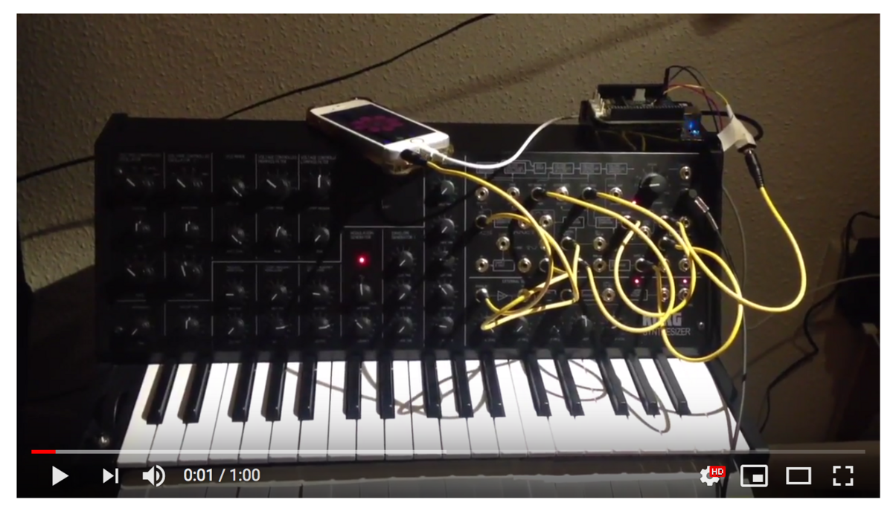

# Kakapo

Korg MS-20 sequencer written in Pure Data for [Bela](http://bela.io/). `Host.pd` generates float numbers which are then converted to voltages on Bela in `_main.pd`.
```
Bela analog out 1 => MS-20 VCO 1+2 CV IN
Bela analog out 2 => MS-20 TRIG IN
```

## Demo

[](https://www.youtube.com/watch?v=HdxeNhHdwMs)

## Patch


## Features
- 8 steps
- adjustable tempo
- adjustable trigger duration
- pitch quantization
	- Linear (slider values are sent out as is), 
	- Cmajor (values are rounded up to a closest note in C major scale),
	- Cminor (values are rounded up to a closest note in C minor scale)

## CV
Korg [MS-20 uses](https://en.wikipedia.org/wiki/CV/gate#CV) Hertz per volt (Hz/v) CV implementation. Therefore slider values are converted to voltages accordingly. If the sequencer needs to be used with a different synth, the conversion coefficient would need to be adjusted.

## Trigger
Korg [MS-20 uses](https://en.wikipedia.org/wiki/CV/gate#Gate) S-trigger or Negative trigger.
